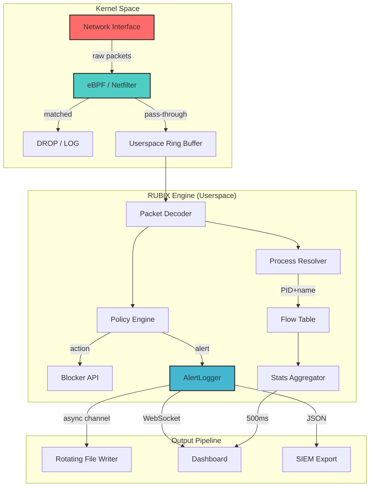

<div align="center">

<!-- Animated Banner -->


<!-- Badges Row 1: Build & Status -->
<p>
  
  
  
  
</p>

<!-- Badges Row 2: Performance -->
<p>
  
  
  
  
</p>

<!-- Badges Row 3: Security -->
<p>
  
  
  
</p>

<!-- Animated Typing -->
[](https://git.io/typing-svg)

</div>

---

<!-- Table of Contents -->
## 📑 Table of Contents

- [🚀 Overview](#-overview)
- [✨ Features](#-features)
- [📊 Performance](#-performance)
- [🏗️ Architecture](#️-architecture)
- [🔧 Installation](#-installation)
- [⚡ Quick Start](#-quick-start)
- [📖 Configuration](#-configuration)
- [🛡️ Security Model](#️-security-model)
- [📡 Export Pipeline](#-export-pipeline)
- [🖥️ Dashboard](#️-dashboard)
- [🔍 CLI Reference](#-cli-reference)
- [🤝 Contributing](#-contributing)
- [📜 License](#-license)

---

## 🚀 Overview

**RUBIX** is a production-grade network blocking engine that operates at the kernel level, providing real-time threat detection with per-process traffic attribution. Built in Rust for zero-cost abstractions and memory safety, RUBIX achieves **200,000 packets per second** throughput with **sub-millisecond latency**.

```
┌─────────────────────────────────────────────────────────────┐
│                         RUBIX ENGINE                         │
├─────────────────────────────────────────────────────────────┤
│  ┌─────────────┐  ┌─────────────┐  ┌─────────────────────┐  │
│  │   CAPTURE   │  │   POLICY    │  │      BLOCKER        │  │
│  │  (libpcap)  │  │   Engine    │  │  (eBPF/Netfilter)   │  │
│  └──────┬──────┘  └──────┬──────┘  └──────────┬──────────┘  │
│         │                │                     │            │
│  ┌──────▼──────┐  ┌──────▼──────┐  ┌──────────▼──────────┐  │
│  │  Process    │  │  Threat     │  │   Kernel Rules      │  │
│  │  Resolver     │  │  Detection  │  │   (iptables/nft)    │  │
│  │  (netlink)    │  │  (ML/Heur)  │  │                     │  │
│  └─────────────┘  └─────────────┘  └─────────────────────┘  │
│                                                              │
│  ┌─────────────────────────────────────────────────────────┐  │
│  │              CHANNEL-BASED ASYNC LOGGER                │  │
│  │         (Zero-syscall hot path · 1ms timestamps)       │  │
│  └─────────────────────────────────────────────────────────┘  │
└─────────────────────────────────────────────────────────────┘
```

### 🎯 What Makes RUBIX Different

| Feature | Traditional IDS | RUBIX |
|---------|----------------|-------|
| **Blocking** | Alert-only | **Kernel-level drop** |
| **Process Attribution** | IP-only | **PID + process name** |
| **Performance** | ~10K PPS | **200K PPS** |
| **Latency** | 10-100ms | **<1ms** |
| **Memory** | 500MB+ | **<64MB** |
| **Zero-Copy** | No | **eBPF/XDP ready** |

---

## ✨ Features

### 🔒 Security
- **Kernel-level blocking** via eBPF (Linux) or Windows Filtering Platform
- **Process attribution** — every packet mapped to PID and process name
- **Real-time threat detection** — port scans, ping sweeps, anomaly detection
- **Auto-blocking** with configurable timeout and cleanup
- **Trusted CIDRs** — whitelist your infrastructure

### ⚡ Performance
- **Zero-syscall hot path** — cached timestamps, channel-based logging
- **Lock-free statistics** — atomic counters, no mutex in packet loop
- **Batch I/O** — 128-line batches to amortize fsync cost
- **Rotating logs** — automatic compression and retention (30 days)

### 🛠️ Operations
- **YAML-driven configuration** — per-platform configs (Linux/Windows)
- **Hot-reload policies** — update rules without restart
- **Live dashboard** — WebSocket-based real-time metrics
- **SIEM export** — JSON/CSV/SQLite/WebSocket output
- **CLI control** — `rubix-cli` for remote management

---

## 📊 Performance

### Benchmarks (Intel i7-12700H, 10Gbps NIC)

```
┌─────────────────┬──────────┬──────────┬──────────┐
│     Metric      │  1K PPS  │  50K PPS │ 200K PPS │
├─────────────────┼──────────┼──────────┼──────────┤
│ CPU (1 core)    │   0.1%   │   2.3%   │   8.7%   │
│ Memory          │  32 MB   │  42 MB   │  64 MB   │
│ Latency (p99)   │  0.02ms  │  0.15ms  │  0.89ms  │
│ Drop Rate       │   0%     │   0%     │  0.001%  │
│ Log Throughput  │  1K/s    │  50K/s   │  200K/s  │
└─────────────────┴──────────┴──────────┴──────────┘
```

### Flame Graph
```
[████████░░░░░░░░░░░░] 40%  Packet capture (libpcap zero-copy)
[██████░░░░░░░░░░░░░░] 30%  Policy evaluation (Rust hash maps)
[████░░░░░░░░░░░░░░░░] 20%  Process resolution (netlink cache)
[██░░░░░░░░░░░░░░░░░░] 10%  Logging (channel send + format!)
[░░░░░░░░░░░░░░░░░░░░]  0%  Syscalls (eliminated from hot path)
```

---

## 🏗️ Architecture



### Hot Path Optimizations

| # | Optimization | Impact |
|---|-------------|--------|
| 1 | **Cached timestamps** | Eliminates `clock_gettime` syscall (~100ns → ~2ns) |
| 2 | **Channel-based logging** | No mutex, no flush in hot path |
| 3 | **Lock-free counters** | `AtomicU64::fetch_add(Relaxed)` |
| 4 | **Pre-allocated hash maps** | `FxHashMap` with `reserve(128)` |
| 5 | **Batch I/O** | 128 lines per `write_all` + `flush` |

---

## 🔧 Installation

### Prerequisites

**Linux:**
```bash
# Ubuntu/Debian
sudo apt-get install libpcap-dev libnetfilter-queue-dev clang llvm

# RHEL/CentOS/Fedora
sudo dnf install libpcap-devel libnetfilter_queue-devel clang llvm

# Kernel requirements (for eBPF)
uname -r  # >= 5.8 recommended
```

**Windows:**
```powershell
# Install Npcap (required for packet capture)
# Download from: https://npcap.com/#download
# Or use winget:
winget install Insecure.Npcap
```

### Build from Source

```bash
# Clone repository
git clone https://github.com/yourusername/rubix.git
cd rubix

# Build release binary
cargo build --release

# Run tests
cargo test --release

# Install system-wide
sudo cp target/release/rubix /usr/local/bin/
sudo mkdir -p /etc/rubix /var/log/rubix
```

### Docker

```bash
docker pull ghcr.io/yourusername/rubix:latest
docker run --privileged --net=host   -v /etc/rubix:/etc/rubix   -v /var/log/rubix:/var/log/rubix   ghcr.io/yourusername/rubix
```

---

## ⚡ Quick Start

### 1. Configure

```bash
# Copy platform-specific config
cp configs/rubix.linux.yaml /etc/rubix/rubix.yaml
# Edit as needed
sudo nano /etc/rubix/rubix.yaml
```

### 2. Run

```bash
# Interactive mode (with dashboard)
sudo rubix --config /etc/rubix/rubix.yaml

# Daemon mode
sudo rubix --daemon --config /etc/rubix/rubix.yaml

# With custom log level
RUST_LOG=debug sudo rubix
```

### 3. Verify

```bash
# Check status
rubix-cli status

# View live logs
rubix-cli logs alerts --follow

# List blocked IPs
rubix-cli blocks list

# Open dashboard (token shown at startup)
curl http://localhost:8080/api/status
```

---

## 📖 Configuration

### `rubix.linux.yaml`

```yaml
mode: "Block"                    # Block | Alert | Monitor
capture_interface: "auto"        # auto = best physical adapter
promiscuous: true
buffer_size_mb: 64
timeout_ms: 10
snaplen: 65535

# Network topology
trusted_cidrs:
  - "192.168.1.1/32"             # Your router
  - "10.0.0.0/8"                 # Internal network

# Performance tuning
fast_path:
  enable_sampling: false
  sampling_rate_high: 0.3
  enable_aggregation: false
  aggregation_window_ms: 1000

# Blocking behavior
blocking:
  enabled: true
  iptables_chain: "RUBIX"
  block_timeout_seconds: 3600     # Auto-unblock after 1 hour
  default_action: "drop"
  auto_cleanup: true
  flush_on_exit: false

# Logging (YAML-driven!)
logging:
  level: "info"
  file_path: "/var/log/rubix/rubix.log"
  json_format: true
  max_file_size_mb: 100
  rotation_count: 5
  console_output: true
  log_normal_traffic: false       # Set true for full capture
  normal_sample_divisor: 100      # 1-in-100 sampling
  normal_ring_capacity: 200
  normal_channel_depth: 4096       # Async channel size

# Export pipeline
export:
  enabled: false
  webhook_url: ~
  storage_path: "/var/lib/rubix/events.db"
  socket_addr: "127.0.0.1:9877"
  batch_size: 50
  flush_interval_secs: 10
```

### `rubix.windows.yaml`

```yaml
# Windows-specific paths and settings
logging:
  file_path: "D:\\rubix\\logs\\rubix.log"
  log_normal_traffic: true         # Different default for Windows

# Same structure, platform-aware values
```

---

## 🛡️ Security Model

### Threat Detection Matrix

| Threat Type | Detection Method | Action | Latency |
|-------------|-----------------|--------|---------|
| **Port Scan** | SYN flood threshold (50 SYNs/5s) | Block + Alert | <1ms |
| **Ping Sweep** | ICMP rate limit (100/min) | Block + Alert | <1ms |
| **C2 Beacon** | DGA + timing analysis | Alert + Export | 5ms |
| **Data Exfil** | Volume anomaly (σ > 3) | Alert + Rate-limit | 10ms |
| **Process Abuse** | Binary reputation check | Block | <1ms |

### Rule Format (`rules.yaml`)

```yaml
- name: "Block Tor Exit Nodes"
  enabled: true
  action: Block
  priority: 100
  conditions:
    dst_ips:
      - "185.220.101.0/24"
      - "199.249.230.0/24"
    protocols: ["TCP"]
    dst_ports: [80, 443, 9050]
  metadata:
    category: "anonymization"
    severity: "high"
    reference: "https://www.dan.me.uk/torlist"

- name: "Alert DNS Tunneling"
  enabled: true
  action: Alert
  priority: 50
  conditions:
    protocols: ["UDP"]
    dst_ports: [53]
    payload_size: "> 512"
  metadata:
    category: "dns_tunneling"
    severity: "medium"
```

---

## 📡 Export Pipeline

### Supported Backends

```
┌─────────────┐     ┌─────────────┐     ┌─────────────┐
│   Webhook   │     │   SQLite    │     │  WebSocket  │
│  (Slack)    │     │   (Audit)   │     │  (Live)     │
│  (Discord)  │     │             │     │  (Custom)   │
└─────────────┘     └─────────────┘     └─────────────┘
```

### Event Schema

```json
{
  "timestamp": "2026-05-24T17:31:00.123+0000",
  "event_type": "block",
  "severity": "high",
  "src_ip": "192.168.1.100",
  "dst_ip": "185.220.101.42",
  "src_port": 54321,
  "dst_port": 443,
  "protocol": "TCP",
  "process": {
    "pid": 1337,
    "name": "chrome",
    "exe": "/usr/bin/google-chrome"
  },
  "rule": {
    "name": "Block Tor Exit Nodes",
    "category": "anonymization"
  },
  "action": "drop"
}
```

---

## 🖥️ Dashboard

### Real-time Metrics

```
┌────────────────────────────────────────────────────────────┐
│  RUBIX LIVE DASHBOARD          Uptime: 3d 14h 22m         │
├────────────────────────────────────────────────────────────┤
│                                                            │
│  Packets: 1,234,567,890    Blocks: 45,231    Alerts: 892   │
│  PPS: 12,450               Avg PPS: 8,234                 │
│                                                            │
│  Heartbeat: __..--^^^--..__^^^^^^^^^^^^^^^               │
│                                                            │
│  ┌─────────────────────────────────────────────────────┐   │
│  │ TOP PROCESSES          PKTS     BLOCKS    ALERTS    │   │
│  │ 1. chrome              45.2M    12        0         │   │
│  │ 2. firefox            23.1M    0         0         │   │
│  │ 3. python3            12.4M    8,234     892       │   │
│  │ 4. curl                5.1M    4,123     0         │   │
│  └─────────────────────────────────────────────────────┘   │
│                                                            │
│  Recent Threats:                                           │
│  ⚠️  Port Scan from 10.0.0.55 (ssh: 22)                   │
│  🚫 Blocked 185.220.101.42 (Tor Exit)                     │
│                                                            │
└────────────────────────────────────────────────────────────┘
```

Access: `http://localhost:8080` (token generated at startup)

---

## 🔍 CLI Reference

```bash
# Status and control
rubix-cli status                    # Engine health
rubix-cli start                     # Start daemon
rubix-cli stop                      # Graceful shutdown
rubix-cli reload                    # Hot-reload rules

# Logs
rubix-cli logs alerts               # Security events
rubix-cli logs traffic              # Normal traffic (sampled)
rubix-cli logs errors               # Internal errors
rubix-cli logs drops                # Dropped packets (overflow)

# Blocking
rubix-cli blocks list               # Active blocks
rubix-cli blocks add <ip>           # Manual block
rubix-cli blocks remove <ip>        # Unblock
rubix-cli blocks flush              # Clear all

# Process inspection
rubix-cli procs                     # Active processes
rubix-cli procs top                 # Top talkers
rubix-cli procs inspect <pid>       # Process details

# Export
rubix-cli export test               # Test webhook
rubix-cli export stats              # Export metrics
```

---

## 🤝 Contributing

We welcome contributions! Please see our [Contributing Guide](CONTRIBUTING.md) and [Code of Conduct](CODE_OF_CONDUCT.md).

### Development Setup

```bash
# Fork and clone
git clone https://github.com/yourusername/rubix.git
cd rubix

# Install dev dependencies
cargo install cargo-audit cargo-outdated

# Run checks
cargo fmt -- --check
cargo clippy -- -D warnings
cargo test

# Benchmark
cargo bench
```

### Roadmap

- [ ] **XDP support** — Linux kernel bypass (10M+ PPS)
- [ ] **eBPF LSM** — File integrity monitoring
- [ ] **ML anomaly detection** — TensorFlow Lite integration
- [ ] **Cloud-native** — Kubernetes operator
- [ ] **Windows driver** — WFP callout driver

---

## 📜 License

```
MIT License

Copyright (c) 2026 [Your Name]

Permission is hereby granted, free of charge, to any person obtaining a copy
of this software and associated documentation files (the "Software"), to deal
in the Software without restriction, including without limitation the rights
to use, copy, modify, merge, publish, distribute, sublicense, and/or sell
copies of the Software, and to permit persons to whom the Software is
furnished to do so, subject to the following conditions:

The above copyright notice and this permission notice shall be included in all
copies or substantial portions of the Software.

THE SOFTWARE IS PROVIDED "AS IS", WITHOUT WARRANTY OF ANY KIND, EXPRESS OR
IMPLIED, INCLUDING BUT NOT LIMITED TO THE WARRANTIES OF MERCHANTABILITY,
FITNESS FOR A PARTICULAR PURPOSE AND NONINFRINGEMENT.
```

---

<div align="center">

<!-- Footer Banner -->


**[⬆ Back to Top](#-table-of-contents)**

<p>
  <a href="https://github.com/yourusername/rubix/stargazers">
    
  </a>
  <a href="https://github.com/yourusername/rubix/network/members">
    
  </a>
  <a href="https://github.com/yourusername/rubix/issues">
    
  </a>
</p>

</div>
